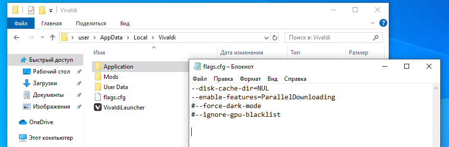

# VivaldiLauncher
(Ещё один) Лаунчер для браузера Vivaldi. Автоматически включает js-модификации, расположенные в папке "Mods" и запускает браузер с параметрами, указанными в файле flags.cfg

Как использовать:
Поместить VivaldiLauncher.exe, папку "Mods" и файл flags.cfg рядом с папкой Application браузера.
Разместить в папке "Mods" JS-моды. Добавить во flags.cfg необходимые параметры запуска, разделяя их пробелами или переносом строки.

(Yet another) Vivaldi browser launcher. Automatically enables js modifications located in the "Mods" folder and starts the browser with the parameters specified in the flags.cfg file

How to use:
Place VivaldiLauncher.exe, the "Mods" folder and the flags.cfg file next to the Application folder of the browser.
Place the JS-mods in the "Mods" folder. Add the necessary startup parameters to flags.cfg, separating them with spaces or line breaks.

